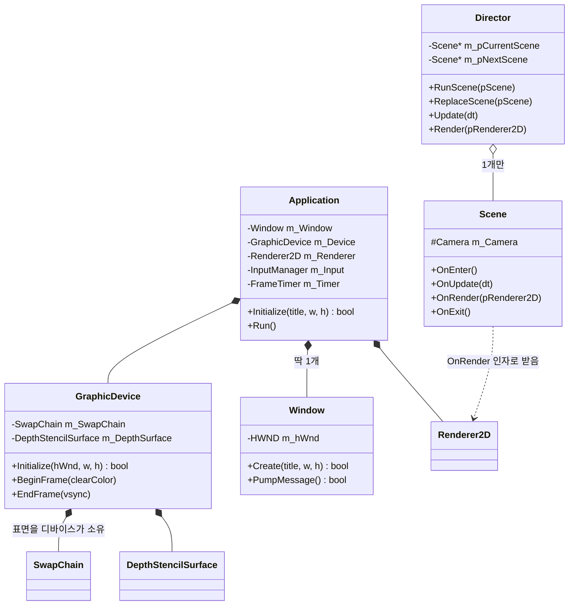
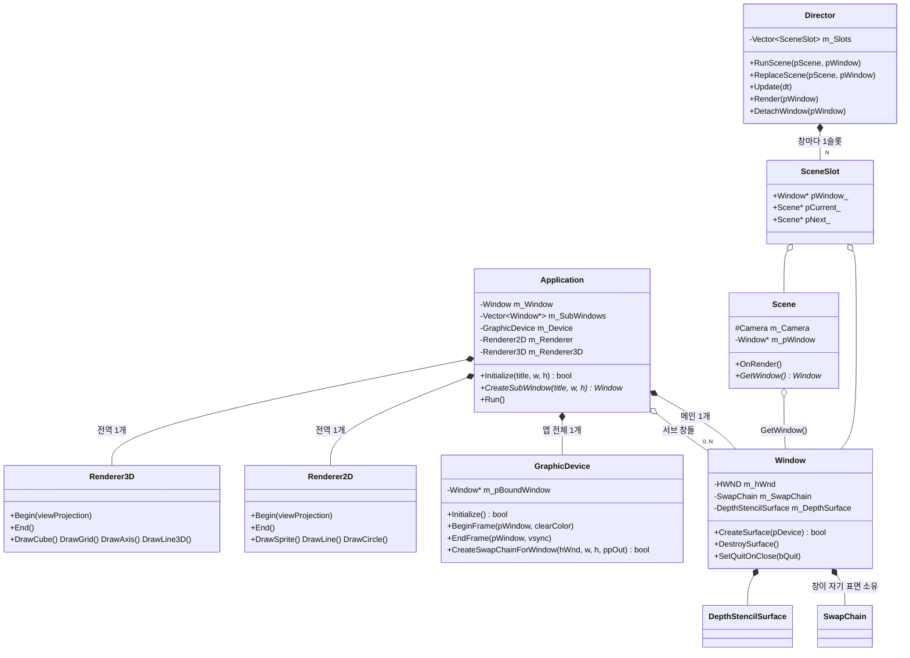

# 26. 엔진 구조 변경 전/후 정리 (v2 → v2.1)

> v1(튜토리얼 모음) → v2(엔진화) 변화는 `25_EngineV2_Architecture.md`를 보세요.
> 이 문서는 **v2 → v2.1**에서 무엇이, 왜 바뀌었는지를 클래스 다이어그램과 코드 diff로 설명합니다.

---

## 1. 한눈에 보는 요약

| 항목 | 변경 전 (v2) | 변경 후 (v2.1) |
|---|---|---|
| 렌더러 | Renderer2D 1개뿐. 씬이 `OnRender(Renderer2D*)` **인자로 받음** | **Renderer2D + Renderer3D 전역 각 1개**. 인자 없이 `g_cRenderer2D` / `g_cRenderer3D` 매크로로 접근 |
| 3D 그리기 | 튜토리얼마다 D3D 호출을 직접 작성 | `DrawCube/DrawGrid/DrawAxis/DrawLine3D` 배치 렌더러 |
| Begin/End | 씬이 직접 호출 (깜빡하면 안 그려짐, 이중 호출 위험) | **Director가 씬 카메라 행렬로 감싸줌**. 씬은 그리기만 |
| 렌더 상태 | 씬이 `SetAlphaBlending` 등을 직접 설정 | **Flush 시점에 렌더러가 스스로 설정** (3D: 깊이켜기 → 2D: 깊이끄기+알파) |
| 윈도우 | Application이 딱 1개 소유 | **메인 1개 + 서브 N개** (`CreateSubWindow`) |
| 스왑체인/깊이버퍼 | GraphicDevice가 소유 (창 1개 전제) | **각 Window가 자기 표면을 소유**, 디바이스는 공유 |
| 씬 ↔ 창 | 씬은 자기가 그려지는 창을 모름 | **`Scene::GetWindow()`** 로 접근 가능 |
| Director | 씬을 1개만 관리 | **창마다 SceneSlot** → 창별로 다른 씬 재생 |

---

## 2. \<변경 전\> 클래스 다이어그램 (v2)



### 변경 전 구조의 문제 3가지

1. **렌더러가 인자에 종속** - 씬이 `OnRender(Renderer2D* _pRenderer)`로 렌더러를 받았기 때문에,
   3D를 그리고 싶으면 시그니처를 또 바꿔야 했습니다. 인자가 늘어날수록 모든 씬 코드가 깨집니다.
2. **창 = 디바이스 1:1 고정** - 스왑체인을 GraphicDevice가 들고 있어서 창을 2개 만들려면
   디바이스도 2개 만들어야 하는 모순이 생깁니다. (실제 D3D11은 디바이스 1개 + 창마다 스왑체인이 정석)
3. **씬이 창을 모름** - 씬 안에서 창 크기나 제목을 다루려면 전역으로 돌아가야 했습니다.

---

## 3. \<변경 후\> 클래스 다이어그램 (v2.1)



핵심 관계: **디바이스(공장)는 앱에 1개, 표면(진열대)은 창마다 1개, 렌더러(그림 도구)는 전역 1개씩.**

---

## 4. 판단 1: 렌더러는 씬마다? 창마다? 전역 1개?

**결론: 전역 1개씩 (Application 소유, Renderer2D + Renderer3D)**

| 후보 | 장점 | 단점 | 판정 |
|---|---|---|---|
| 씬마다 1개 | 씬끼리 완전 독립 | 씬 N개 = 같은 셰이더를 N번 컴파일, 배치 버퍼 N개 낭비. 씬 교체마다 GPU 리소스 생성/파괴 | ❌ |
| 창마다 1개 | 창별 독립적 그리기처럼 보임 | 사실 착각. D3D11 immediate context는 **1개**라 어차피 동시에 못 그림. 서브 창을 열 때마다 리소스 중복 | ❌ |
| **전역 1개씩** | 셰이더/배치버퍼를 한 번만 만들고 모두 공유. 초기화/종료 단순 | 프레임마다 "지금 어느 창/카메라인지" 알려줘야 함 → 이미 구조가 해결 | ⭕ |

전역 1개로 충분한 이유:

1. **GPU 리소스는 디바이스 소속이지 창/씬 소속이 아니다.** 셰이더와 버퍼는
   ID3D11Device로 만드는데, 디바이스는 앱 전체에 1개뿐입니다. 그러니 렌더러도 1개면 됩니다.
2. **"어디에 그릴지"는 렌더러의 상태가 아니다.** 매 프레임
   `GraphicDevice::BeginFrame(pWindow)`가 대상 창을, `Renderer::Begin(카메라 행렬)`이
   보는 눈을 정해줍니다. 렌더러는 정점을 모았다 버퍼에 붓는 역할만 합니다.
3. **인자 종속 제거와도 맞물립니다.** 전역이니 `g_cRenderer2D` / `g_cRenderer3D` 매크로로
   어디서든 접근 가능 → `OnRender()`에서 인자가 사라집니다.

---

## 5. 판단 2: 배치(batch) 방식이 맞는가?

**결론: 맞다. 2D는 기존 배치 유지, 3D도 배치 도입.**

- 비유: 택배를 하나 사서 하나 배송받기를 100번 반복하는 것(draw call 100번)보다,
  장바구니에 모아담았다가 한 번에 받는 것(draw call 1번)이 훨씬 싸고 빠릅니다.
  draw call은 CPU→GPU 명령 전달 비용이 커서, 적을수록 좋습니다.
- Renderer3D는 삼각형 배치(최대 4096개)와 선 배치(최대 4096개)를 따로 모아두었다가
  가득 차거나 `End()` 시점에 한 번에 Flush합니다.
- **렌더 상태는 Flush 시점에 렌더러가 스스로 설정**합니다. 씬이 상태를 건드리다
  깜빡하는 사고를 원천 차단합니다.
  - Renderer3D::Flush → 깊이테스트 ON, 알파블렌딩 OFF (입체는 앞뒤 판정 필요)
  - Renderer2D::Flush → 깊이테스트 OFF, 알파블렌딩 ON (UI/스프라이트는 그리는 순서대로)
- Director::Render는 한 프레임에 **3D 배치 먼저 닫고 → 2D 배치를 나중에** 닫습니다.
  그래서 2D(UI)가 항상 3D 장면 위에 그려집니다.

---

## 6. 주요 코드 diff

### 6.1 Scene - 렌더러 인자 제거 + 창 정보 보유 (요구 1, 2)

```diff
 // Scene.h
 class Scene {
 public:
     virtual void OnEnter() {}
     virtual void OnUpdate(const jc::TimeSpan& _dt) { (void)_dt; }
-    virtual void OnRender(Renderer2D* _pRenderer) { (void)_pRenderer; }
+    virtual void OnRender() {}      // 인자 없음! g_cRenderer2D/g_cRenderer3D로 그린다
     virtual void OnExit() {}
 
     Camera& GetCamera() { return m_Camera; }
+    Window* GetWindow() const { return m_pWindow; }  // 이 씬이 그려지는 창
 
 protected:
     Camera m_Camera;
+
+private:
+    friend class Director;           // Director만 창을 연결할 수 있다
+    void SetWindow(Window* _pWindow) { m_pWindow = _pWindow; }
+    Window* m_pWindow;
 };
```

### 6.2 Director - 씬 1개 → 창마다 SceneSlot (요구 2, 3)

```diff
 // Director.h
-    Scene* m_pCurrentScene;
-    Scene* m_pNextScene;
+    struct SceneSlot {
+        Window* pWindow_;    // 어느 창에
+        Scene*  pCurrent_;   // 지금 무슨 씬이 돌고 있고
+        Scene*  pNext_;      // 다음 프레임에 무엇으로 바뀌는지
+    };
+    jc::Vector<SceneSlot> m_Slots;
 
-    void RunScene(Scene* _pScene);
-    void ReplaceScene(Scene* _pScene);
-    void Render(Renderer2D* _pRenderer);
+    void RunScene(Scene* _pScene, Window* _pWindow = nullptr);   // nullptr = 메인 창
+    void ReplaceScene(Scene* _pScene, Window* _pWindow = nullptr);
+    void Render(Window* _pWindow);        // "이 창에 올라간 씬을 그려라"
+    void DetachWindow(Window* _pWindow);  // 창이 닫힐 때 씬 정리
```

```diff
 // Director.cpp - Render: Begin/End를 씬 대신 감싸준다
-void Director::Render(Renderer2D* _pRenderer)
-{
-    if (m_pCurrentScene != nullptr) {
-        m_pCurrentScene->OnRender(_pRenderer);   // Begin/End는 씬이 직접
-    }
-}
+void Director::Render(Window* _pWindow)
+{
+    SceneSlot* pSlot = FindSlot(ResolveWindow(_pWindow));
+    if (pSlot == nullptr || pSlot->pCurrent_ == nullptr) {
+        return;
+    }
+    const Mat4 viewProjection = pSlot->pCurrent_->GetCamera().ViewProjection();
+    g_cRenderer3D.Begin(viewProjection);   // 두 배치를 열고
+    g_cRenderer2D.Begin(viewProjection);
+    pSlot->pCurrent_->OnRender();          // 씬은 그리기만 한다
+    g_cRenderer3D.End();                   // 3D 먼저 (깊이 ON)
+    g_cRenderer2D.End();                   // 2D 나중 (항상 위에)
+}
```

### 6.3 Window / GraphicDevice - 표면 소유권 이동 (요구 3)

```diff
 // GraphicDevice.h
-    bool Initialize(HWND _hWnd, _s32 _width, _s32 _height); // 창 1개 전제
-    void BeginFrame(const Color& _clearColor);
-    void EndFrame(bool _bVsync);
-    SwapChain m_SwapChain;                 // 디바이스가 표면 소유
-    DepthStencilSurface m_DepthSurface;
+    bool Initialize();                     // 디바이스만 생성 (창과 무관)
+    void BeginFrame(Window* _pWindow, const Color& _clearColor);
+    void EndFrame(Window* _pWindow, bool _bVsync = true);
+    bool CreateSwapChainForWindow(HWND _hWnd, _s32 _width, _s32 _height,
+                                  IDXGISwapChain** _ppOutSwapChain);
+    Window* m_pBoundWindow;                // 지금 그리는 대상 창
```

```diff
 // Window.h - 창이 자기 표면을 소유
+    bool CreateSurface(GraphicDevice* _pDevice);  // 스왑체인+깊이버퍼 생성
+    void DestroySurface();
+    bool HasSurface() const;
+    void SetQuitOnClose(bool _bQuit);  // 서브 창은 닫혀도 앱 종료 안 됨
+    SwapChain m_SwapChain;
+    DepthStencilSurface m_DepthSurface;
```

### 6.4 Application - 멀티 윈도우 루프 (요구 1, 3)

```diff
 // Application.h
     Window m_Window;                    // 메인 창
+    jc::Vector<Window*> m_SubWindows;   // 서브 창들 (0..N개)
     Renderer2D m_Renderer;
+    Renderer3D m_Renderer3D;            // 3D도 전역 1개
+    Window* CreateSubWindow(const wchar_t* _szTitle, _s32 _width, _s32 _height);
 
 // 매크로
 #define g_cRenderer2D (sgf::__sSgfApplication->GetRenderer())
+#define g_cRenderer3D (sgf::__sSgfApplication->GetRenderer3D())
```

```diff
 // Application.cpp - Run 루프
-        m_Device.BeginFrame(m_ClearColor);
-        g_cDirector.Render(&m_Renderer);
-        OnRender();
-        m_Device.EndFrame(m_bVsync);
+        DestroyClosedSubWindows();                    // 닫힌 창 정리
+
+        m_Device.BeginFrame(&m_Window, m_ClearColor); // 메인 창
+        g_cDirector.Render(&m_Window);
+        OnRender();
+        m_Device.EndFrame(&m_Window, m_bVsync);
+
+        for (int i = 0; i < m_SubWindows.Size(); ++i) { // 서브 창들
+            Window* pSub = m_SubWindows[i];
+            if (pSub->IsClosed() || !pSub->HasSurface()) { continue; }
+            m_Device.BeginFrame(pSub, m_ClearColor);
+            g_cDirector.Render(pSub);
+            m_Device.EndFrame(pSub, m_bVsync);
+        }
```

### 6.5 사용 쪽(ch14 튜토리얼) 변화

```diff
-    void OnRender(Renderer2D* _pRenderer) override
-    {
-        g_cDevice.SetAlphaBlending(true);      // 상태도 씬이 직접
-        g_cDevice.SetDepthTest(false);
-        _pRenderer->Begin(GetCamera().ViewProjection());
-        _pRenderer->DrawSprite(&m_SunTexture, sunPos, Vec2(120.0f, 120.0f));
-        _pRenderer->End();
-    }
+    void OnRender() override
+    {
+        // 상태/Begin/End 모두 엔진이 처리. 그리기만 하면 된다.
+        g_cRenderer2D.DrawSprite(&m_SunTexture, sunPos, Vec2(120.0f, 120.0f));
+    }

 // 씬이 창을 안다 (요구 2) + 서브 윈도우 (요구 3)
+    GetWindow()->SetTitle(L"14. 태양계 씬 - SPACE: 씬 교체 / M: 서브 윈도우");
+    if (g_cInput.IsKeyPressed('M')) {
+        Window* pSub = g_cApp.CreateSubWindow(L"서브 윈도우", 480, 360);
+        if (pSub != nullptr) {
+            g_cDirector.RunScene(CreateBouncingBallScene(), pSub);
+        }
+    }
```

---

## 7. 컸벤션/오류 수정 내역 (요구 4)

| 분류 | 내용 |
|---|---|
| 자료형 | 새 코드의 `int` → `_s32` 통일 (Initialize/CreateSubWindow 시그니처, ch14 상수/루프). 단, `jc::Vector::Size()`가 `int`를 반환하므로 컸테이너 순회 변수는 jc 관례대로 `int` 유지 |
| 컸테이너 | 서브 창/씬 슬롯 목록에 `std::vector` 대신 **`jc::Vector`** 사용. 엔진 전체 `std::` 사용 0건 확인 |
| 잠복 버그 | v2에서 Director와 씬이 **Begin을 이중 호출**하던 구조 (jc_assert 사망 가능) → Director만 호출하도록 정리 |
| 오류 | Renderer3D::Finalize가 존재하지 않는 `Shader::Destroy()`를 부를 뻔한 것 수정 (소멸자가 정리하는 구조로 통일) |
| 오류 | Application.cpp에 구 v2 본문과 v2.1 본문이 중복 정의된 상태 발견 → v2.1로 단일화 |
| 오류 | 존재하지 않는 `JC_UNUSED` 매크로 → `(void)인자;` 패턴으로 교체 |
| 오타 | 한글 주석 오타(섮→섞, 쥤→쌓 등) 일괄 수정 |
| 빌드 | Renderer3D.cpp/.h를 sgf.vcxproj에 등록, SgfHeader.h에 include 추가 |
| 호환성 | 구 방식 `Initialize(HWND,w,h)` / `BeginFrame(color)`는 레거시로 유지해 03~22장 튜토리얼이 그대로 빌드되게 함 |
