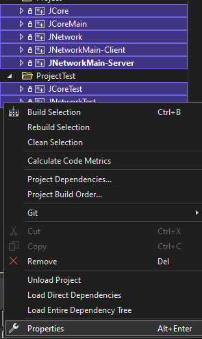

### 개발환경 구성요소
1. MySQL Server 5.0.27 [필수]
2. Visual Studio 2022 or 2019 [필수]  
단, Visual Studio 설치 구성 요소 중 Deskop development With C++이 체크되어 설치되어있어야 합니다.

3. MySQL Workbench 8.0.37 [선택]
   
 
 

### Visual Studio 2019 빌드 방법
1. Visual Studio 2019로 Harmony_VS2022.sln 솔루션을 엽니다.
2. Example, Project, Project 필터 내의 모든 프로젝트를 한번에 선택한 후 우클릭 속성에 들어갑니다.
   (Engine 필터는 건들지 않도록합니다.)
 

3. 플랫폼 툴셋은 2019로 변경합니다.

 

### TankFighter 실행 방법
1. 서버 Bind Port, DB 연결 설정 변경은 [ServerConfigureation.h](../Projects/TankFighter-Server/Sources/TF/ServerConfiguration.h)파일에서 수정가능합니다.
원하는 설정으로 변경후 저장합니다.
2. 클라이언트 연결 설정은 [ClientConfiguration.h](../Projects/TankFighter-Client/Classes/TF/Network/ClientConfiguration.h)파일에서 수정이 가능합니다.
원하는 설정으로 변경 후 저장합니다.
3. 통합 SQL 스크립트는 Projects/TankFighter-Server/SQL/TankFighter.sql을 MySQL로 실행합니다. 
5. 솔루션에서 TankFighter-Server 프로젝트를 선택하고 Ctrl + F5를 눌러서 실행합니다.
6. 솔루션에서 TankFighter-Client 프로젝트를 선택하고 Ctrl + F5를 눌러서 실행합니다.

 

### 그 외의 프로젝트
F5를 눌러서 간단하게 빌드 & 실행 할 수 있습니다.

 

### 주의사항
빌드 플랫폼은 무조건 x86 아키텍쳐를 선택합니다.  
x64는 프로젝트 세팅을 해놓지 않아서 빌드에 실패합니다.