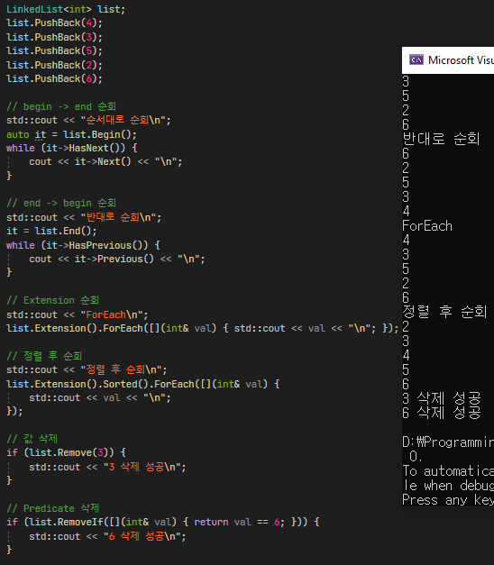

# 컨테이너

### 특징
1. 가상함수를 사용하기 때문에 STL 컨테이너보다 무겁습니다.
2. 컨테이너 타입이 서로 다르더라도 같은 컬렉션 타입인 경우 서로 호환됩니다.
3. STL 컨테이너에 비해 사용방법이 단순하고 직관적입니다.

 

### 클래스 구조

 

### 연결리스트 사용 예시

 

### 해쉬맵 사용 예시

 

### 트리맵 사용 예시

 

### 프로퍼티 사용 예시

