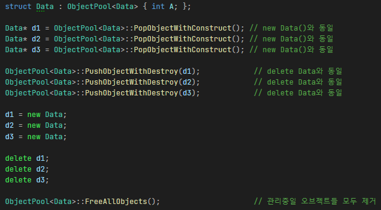
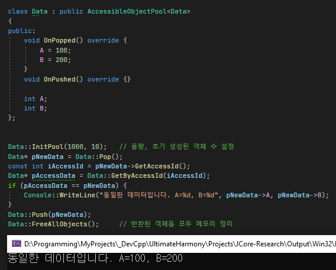
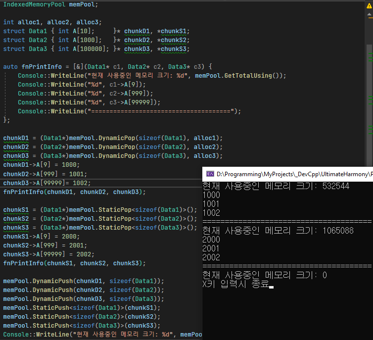

# 메모리 풀

### 특징
1. ObjectPool\<T\>을 상속받은 객체는 손쉽게 풀링이 가능합니다.  
2. AccessibleObjetPool\<T\>는 ObjectPool과 달리 풀의 원소들에 직접적으로 매우 빠르게 접근할 수 있습니다.
3. 메모리풀은 메모리청크 획득방식에 따라 나눠서 구현하였습니다.  
    * Indexed: O(1)의 시간복잡도로 메모리 블록을 얻습니다. 단, BinarySearch 메모리풀에 비해 메모리를 많이 차지합니다.
    * BinarySearch:O(logn)의 시간복잡도로 메모리 블록을 얻습니다.
    
 

### 참고사항
초기에 구현한게 BinarySearch방식의 메모리풀이고  
좀더 성능을 끌어올릴 수 없을까 고민해서 구현한게 Indexed방식의 메모리풀입니다.

 

### ObjectPool\<T\> 사용 예시

 

### AccessibleObjectPool\<T\> 사용 예시

 

### IndexedMemoryPool 사용 예시

 

