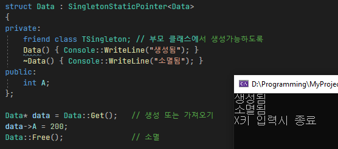

# 패턴

### 특징
1. 싱글톤 클래스를 쉽게 생성할 수 있도록 여러가지 싱글톤 클래스를 지원합니다. 
    * 정적 싱글톤  
      * 모든 컴파일러에 대해서 쓰레드 세이프하다
      * 오브젝트가 프로그램 종료시 자동 소멸된다.
      * 쉽고 간단하다.
      * 프로그램 시작시 메모리 용량을 차지하고 있기 때문에 늦게 생성된다고 하더라도 무거운 객체의 경우 비효율적일 수 있다.
    * 포인터 싱글톤
      * 내생각에는 딱히 단점이 없는 듯하다..

 

### Singleton 사용 예시
