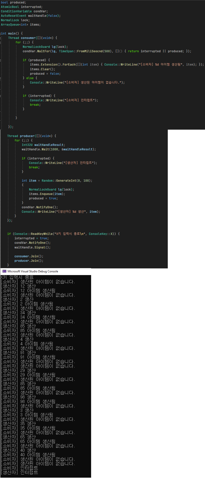

# 동기화 객체

### 특징
1. ConditionVariable은 WinAPI ConditionVariable을 랩핑한 후 std::condition_variable과 동일한 기능을 수행토록 변경한 클래스입니다.  
    굳이 새롭게 만든 이유는 std::condition_variable의 경우
    wait_until(), wait_for() 함수가 std::chrono 시간 라이브러리와 연관되어 있기 때문에 제가 개발한 시간 라이브러리와 호환되지 않아서 사용에 불편했기 때문입니다.
2. ManualResetEvent과 AutoResetEvent는 C#에서 자주 사용하던 기능을 모방하여 구현하였습니다. WinAPI의 CreateEvent() 함수를 기반으로 구현하였습니다.
3. SpinLock의 경우 제가 제일 처음 구현해본 동기화 객체입니다. 십어먹는 C++ 강좌를 보면서 구현하였습니다.
4. NormalLock의 경우 std::mutex와 동일한 기능을 수행합니다.
동일한 쓰레드에서 연속하여 잠금을 수행할 수 없습니다.
5. RecursiveLock의 경우 std::recursive_lock과 동일한 기능을 수행합니다. 동일한 쓰레드인경우 연속하여 잠금을 수행할 수 있습니다.
6. NormalRwLock의 경우 읽기락, 쓰기락을 구분하여 잠금을 수행할 수 있도록 합니다. ReadLock의 경우 WriteLock이 되어있지 않으면 여러 쓰레드가 동시에 접근하는게 가능합니다. WriteLock의 경우 ReadLock이 되어있지 않다면 동시에 하나의 쓰레드만 접근할 수 있습니다.

 

### 생산자 소비자 패턴 예시

 