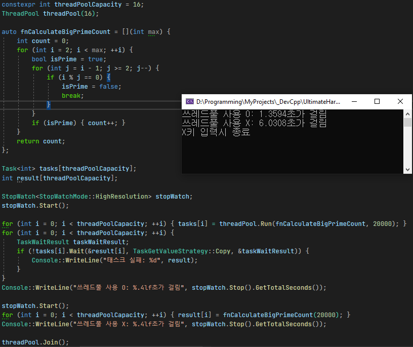

# 쓰레드

### 특징
1. 쉽고 편하게 쓰레드를 생성할 수 있습니다.
2. ThreadPool을 생성하여 비동기 태스크를 손쉽게 처리할 수 있습니다.
3. Scheduler를 사용하여 비동기 태스크를 주기적으로 처리할 수 있습니다.

 

### Thread 사용 예시

 

### ThreadPool 사용 예시

 

### Scheduler 사용 예시

 
