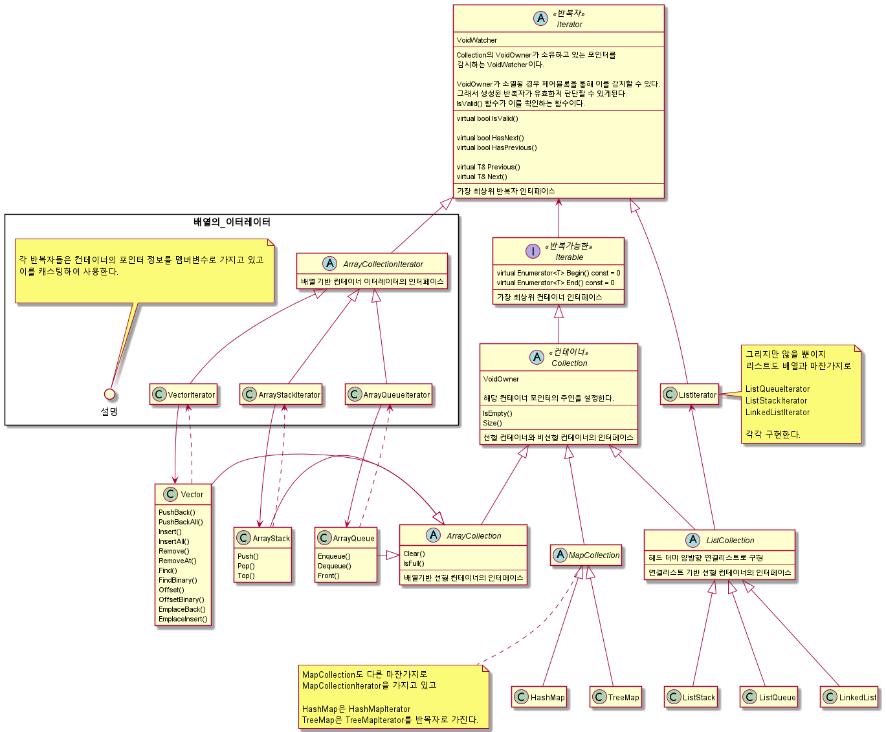
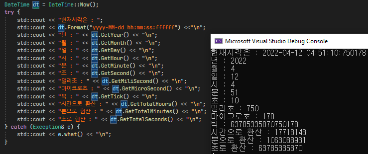
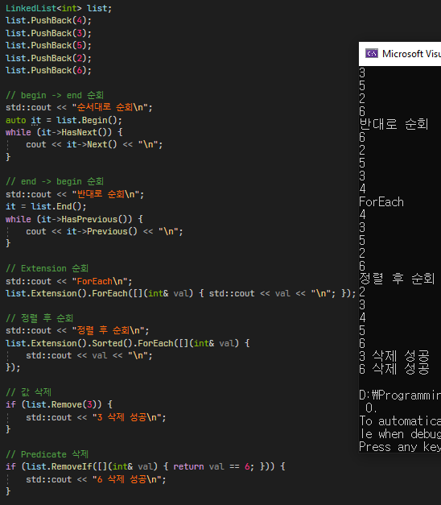
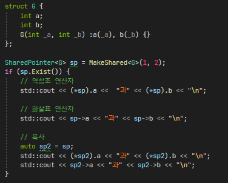
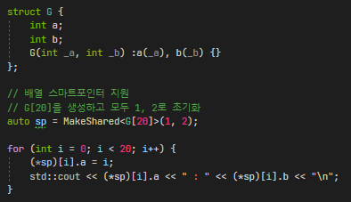
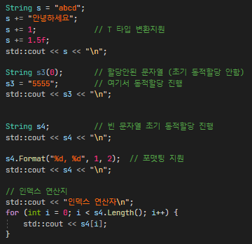

### JCore 프로젝트
자바와 C#에 존재하는 편리한 기능을 C++에서도 사용해보고 싶어서 개발한 C++ 라이브러리 프로젝트입니다.

### JCore 컨테이너 구조

### JCore 주요 기능
 - 시간/날짜 처리
   * DateTime
   * DateAndTime
   * Time
   * Date
 - 자바와 유사한 컨테이너 기능
   * LinkedList
   * ListStack
   * ListQueue
   * HashMap
   * Vector
   * ArrayStack
   * ArrayQueue
 - 스마트 포인터
   * SharedPointer
   * WeakPointer
   * UniquePointer
 - 문자열 처리
   * String
   * StringUtil
   * StaticString
 - 뮤텍스
   * CriticalSectionMutex
   * EventMutex
   * Semaphore
   * SpinLock

### JCore 주요 기능 사용 간단한 예시
 - 시간/날짜  
  

이외에 시간 차이 계산, 날짜 계산 등 다양한 기능을 지원합니다.   
자세한 예시는 JCoreTest의 DateTimeTest.cpp 파일을 참고하시면됩니다.

 

- 컨테이너  

   
 

- 스마트 포인터  

 

- 스마트 포인터 배열 지원

 

- 문자열  

  

### JCore 프로젝트 진행을 위해 학습한 내용
1. [타입 별칭 (Type Alias)](https://blog.naver.com/wjdeh313/222615121589)
2. [좌측값과 우측값 (lvalue & rvalue)](https://blog.naver.com/wjdeh313/222615121910)
3. [무브 시멘틱 (Move Semantics)](https://blog.naver.com/wjdeh313/222615341416)
4. [템플릿 매개변수 타입 추론 (Template Parameter Type Deduction)](https://blog.naver.com/wjdeh313/222616847683)
5. [Auto 타입 추론 (Auto Type Deduction)](https://blog.naver.com/wjdeh313/222616913687)
6. [완벽한 전달 (Perfect Forwarding)](https://blog.naver.com/wjdeh313/222617856774)
7. [Decltype 타입 추론](https://blog.naver.com/wjdeh313/222618643998)
8. [가변 템플릿 (Variadic Template)](https://blog.naver.com/wjdeh313/222620715563)
9. [상수 표현식 (Const Expression, constexpr)](https://blog.naver.com/wjdeh313/222621831140)
10. [템플릿 인스턴스화 (Template Instantiation)](https://blog.naver.com/wjdeh313/222622599396)
11. [템플릿 특수화 (Template Specialization)](https://blog.naver.com/wjdeh313/222623206660)
12. [템플릿 메타 프로그래밍 (TMP, Template Meta Programming)](https://blog.naver.com/wjdeh313/222623922363)
13. [RAII와 스마트 포인터 (Resource Acquisition Is Initialization && Smart Pointer)](https://blog.naver.com/wjdeh313/222624820932)
14. [모던 C++ 튜토리얼 조금](https://github.com/changkun/modern-cpp-tutorial)
15. [모두의 코드](https://modoocode.com/221#page-heading-1)
16. [Effective Modern C++ 조금](http://ajwmain.iptime.org/programming/book_summary/%5B03%5Deffective_modern_cpp/effective_modern_cpp.html)