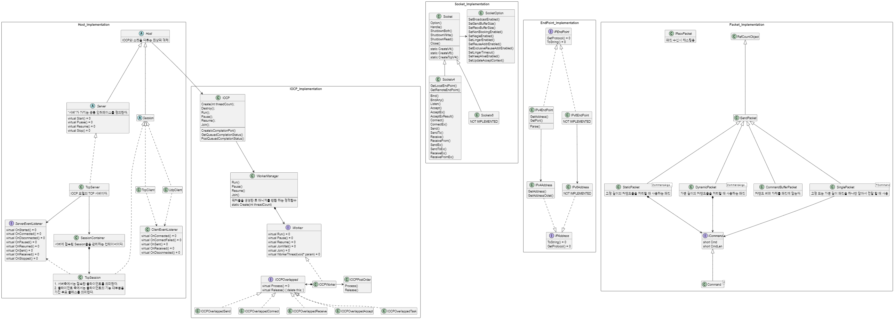

### JNetwork 프로젝트
네트워크 라이브러리 프로젝트입니다.

 

### JNetwork 클래스 구조도

  
 

### JNetwork 주요 기능
 - IOCP 기반의 TCP, UDP 서버/클라이언트 [설명 보기](./project_jnetwork-feature-iocp-host.md)
	* TcpClient
	* UdpClient
	* TcpServer
 - 소켓	[설명 보기](./project_jnetwork-feature-socket.md)
    * Socketv4
 - IP 주소 [설명 보기](./project_jnetwork-feature-ip-address.md)
	* IPv4Address
	* IPv4EndPoint

 

### JNetwork 프로젝트 진행을 위해 학습한 내용
1. 열형강의 TCP/IP
2. 윈도우 TCP/IP 소켓 프로그래밍
3. [소켓의 정의](https://blog.naver.com/wjdeh313/222660919100)
4. [프로토콜과 소켓 생성(SOCK_RAW, AF_INET과 PF_INET의 차이)](https://blog.naver.com/wjdeh313/222661297089)
5. [TCP 데이터 경계 확인, TCP 통신 예제 코드(bind, listen, accept) 이해하기](https://blog.naver.com/wjdeh313/222662321811)
6. [UDP 데이터 경계 확인, UDP 통신 예제 코드(connect, send, recv, sendto, recvfrom) 이해하기](https://blog.naver.com/wjdeh313/222664855781)
7. [우아한 종료 (shutdown)](https://blog.naver.com/wjdeh313/222665434178)
8. [SO_LINGER](https://blog.naver.com/wjdeh313/222668166724)
9. [SO_REUSEADDR](https://blog.naver.com/wjdeh313/222669749503)
10. [SO_REUSEADDR](https://blog.naver.com/wjdeh313/222669749503)