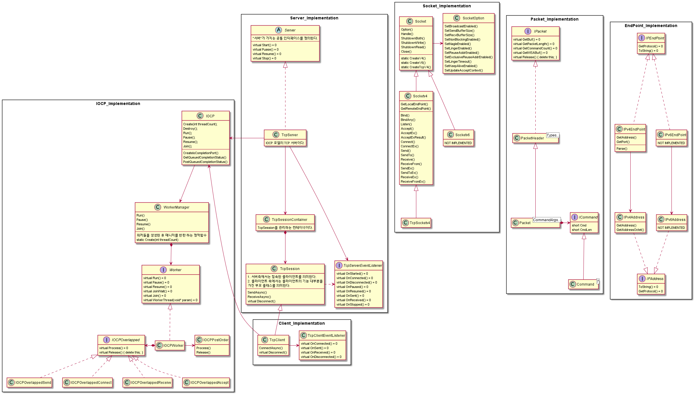
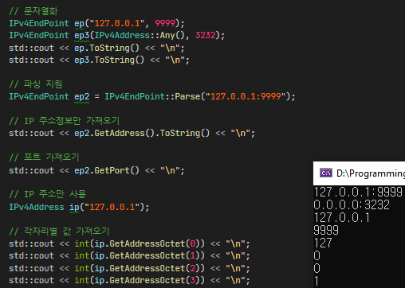
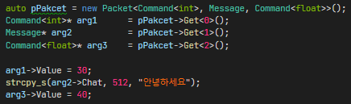
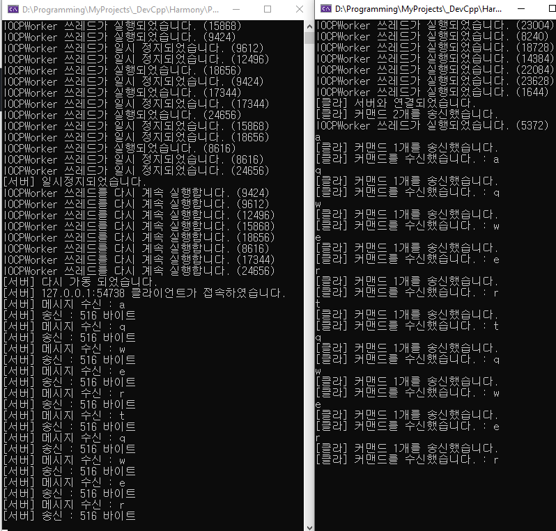

### JNetwork 프로젝트
네트워크 라이브러리 프로젝트입니다.

### JNetwork 구조

  
<br>

### JNetwork 주요 기능
 - IOCP 기반의 TCP 서버/클라이언트
 - 서버 클라이언트에 콜백 방식의 간단한 인터페이스 지원
 - 소켓을 쉽게 다루기 위한 기능 지원
 - IP 주소 정보를 쉽게 다룰 수 있도록 기능 지원

<br>

### JNetwork 주요 기능 사용 간단한 예시

 - #### IPv4EndPoint
아이피 주소 포트정보 쉽게 다루기  


<br>
<br>

- #### 패킷에 여러개의 커맨드 담기  


<br>
<br>

 * 에코 클라이언트  
```cpp

#define _WINSOCKAPI_			// Winsock.h include 방지

#include <JCore/LockGuard.h>

#include <JNetwork/Network.h>	// 1. JCore.lib 링크
								// 2. Mswsock.lib 링크
								// 3. ws2_32.lib 링크

#include <JNetwork/Winsock.h>
#include <JNetwork/Host/TcpClient.h>

using namespace JCore;
using namespace JNetwork;

struct Message : ICommand
{
	Message() {
		this->Cmd = 0;	// 명령어 코드값 (개발시 사용)
		this->CmdLen = sizeof(Message);
	}

	char Chat[512];
};


class MyClientEventListener : public TcpClientEventListener
{
protected:
	virtual void OnConnected() {
		Winsock::Message("[클라] 서버와 연결되었습니다.");
	}
	virtual void OnDisconnected() {
		Winsock::Message("[클라] 연결이 종료되었습니다.");
	}

	virtual void OnSent(ISendPacket* sentPacket, Int32UL sentBytes) {
		Winsock::Message("[클라] 커맨드 %d개를 송신했습니다.", sentPacket->GetCommandCount());
	}

	virtual void OnReceived(ICommand* cmd) {
		Winsock::Message("[클라] 커맨드를 수신했습니다.");
	}
};


int main() {
	CriticalSectionMutex mtx;

	Winsock::SetMutex(&mtx);
	Winsock::Initialize(2, 2);

	TcpClient client;
	MyClientEventListener myClientEventListener;
	client.SetEventListener(&myClientEventListener);


	if (client.ConnectAsync("127.0.0.1:9999")) {
		while (1) {

			// 패킷에는 여러개의 커맨드를 담아서 한번에 전송가능
			auto pPacket = new Packet<Message>();
			Message* arg1 = pPacket->Get<0>();
			std::cout << "[클라] 서버로 전송할 메시지 입력 : ";
			std::cin >> arg1->Chat;

			// 클라이언트 종료
			if (arg1->Chat[0] == 'c') {
				break;
			}

			if (!client.SendAsync(pPacket)) {
				std::cout << "[클라] 송신 실패\n";
			}
		}
	}


	if (!client.Disconnect()) {
		std::cout << "[클라] 연결 종료 실패\n";
	}

	Winsock::Finalize();
	return 0;
}
```

<br>
<br>

 - ###에코 서버    
```cpp

#include <JNetwork/Network.h>
#include <JNetwork/Winsock.h>
#include <JNetwork/Host/TcpServer.h>

#define _WINSOCKAPI_

#include <JCore/LockGuard.h>

using namespace JCore;
using namespace JNetwork;

struct Message : ICommand
{
	Message() {
		this->Cmd = 0;	// 명령어 코드값 (개발시 사용)
		this->CmdLen = sizeof(Message);
	}

	char Chat[512];
};

class MyServerEventListener : public TcpServerEventListener
{
protected:
	void OnStarted() override {
		Winsock::Message("[서버] 서버가 시작되었습니다.");
	}

	void OnConnected(TcpSession* connectedSession) override { 
		Winsock::Message("[서버] %s 클라이언트가 접속하였습니다.", 
			connectedSession->GetRemoteEndPoint().ToString().Source());
	}

	void OnDisconnected(TcpSession* disconnetedSession) override {
		Winsock::Message("[서버] %s 클라이언트가 접속하였습니다.",
			disconnetedSession->GetRemoteEndPoint().ToString().Source());
	}

	void OnSent(TcpSession* sender, ISendPacket* packet, Int32UL sentBytes) override {
		Winsock::Message("[서버] 송신 : %d 바이트", packet->GetPacketLength());
	}

	void OnReceived(TcpSession* receiver, ICommand* cmd) override {
		// 수신한 메시지 출력
		Message* pMsg = cmd->CastCommand<Message*>();
		Winsock::Message("[서버] 메시지 수신 : %s", pMsg->Chat);

		// 에코 진행
		auto pPacket = new Packet<Message>();
		Message* arg1 = pPacket->Get<0>();
		strcpy_s(arg1->Chat, 512, pMsg->Chat);

		if (!receiver->SendAsync(pPacket)) {
			Winsock::Message("[서버] 에코 실패");
		}
	}

	void OnPaused() override {
		Winsock::Message("[서버] 일시정지되었습니다.");
	}

	void OnResume() override {
		Winsock::Message("[서버] 다시 가동 되었습니다.");
	}

	void OnStopped() override {
		Winsock::Message("[서버] 종료되었습니다.");
	}
};


int main() {
	CriticalSectionMutex mtx;

	Winsock::SetMutex(&mtx);
	Winsock::Initialize(2, 2);

	TcpServer server;
	MyServerEventListener myServerEventListener;

	// 서버 이벤트 리스너 등록
	server.SetEventListener(&myServerEventListener);

	// 서버 실행
	if (server.Start("0.0.0.0:9999")) {
		server.Pause();		// 서버 일시정지 기능
		server.Resume();	// 서버 계속 진행
	}

	// c 입력시 서버 종료
	while (getchar() != 'c') {}
	server.Stop();
	

	Winsock::Finalize();
	return 0;
} 
```

<br>
<br>

 - #### 실행 결과


<br>


### JNetwork 프로젝트 진행을 위해 학습한 내용
1. 열형강의 TCP/IP
2. 윈도우 TCP/IP 소켓 프로그래밍
3. [소켓의 정의](https://blog.naver.com/wjdeh313/222660919100)
4. [프로토콜과 소켓 생성(SOCK_RAW, AF_INET과 PF_INET의 차이)](https://blog.naver.com/wjdeh313/222661297089)
5. [TCP 데이터 경계 확인, TCP 통신 예제 코드(bind, listen, accept) 이해하기](https://blog.naver.com/wjdeh313/222662321811)
6. [UDP 데이터 경계 확인, UDP 통신 예제 코드(connect, send, recv, sendto, recvfrom) 이해하기](https://blog.naver.com/wjdeh313/222664855781)
7. [우아한 종료 (shutdown)](https://blog.naver.com/wjdeh313/222665434178)
8. [SO_LINGER](https://blog.naver.com/wjdeh313/222668166724)
9. [SO_REUSEADDR](https://blog.naver.com/wjdeh313/222669749503)
10. [SO_REUSEADDR](https://blog.naver.com/wjdeh313/222669749503)
