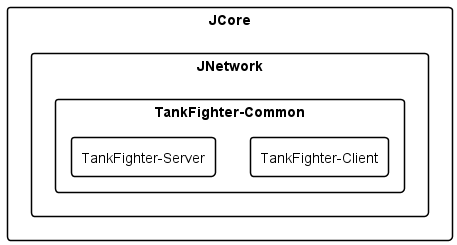

### 프로젝트  종류

※ Engine 솔루션 필터의 프로젝트들은 Cocos2d-x의 프로젝트들입니다.  
제가 개발한 프로젝트들은 Example, Project, ProjectTest 솔루션 필터내의 프로젝트들 입니다.

1. JCore : 모든 프로젝트의 가장 기본이되는 개인용 C++ 라이브러리입니다.
2. JCoreTest : JCore 라이브러리를 테스트하기 위한 구글 테스트 프로젝트입니다.
3. JNetwork : JCore 라이브러리를 바탕으로 제작해본 개인용 네트워크 라이브러리입니다.
4. JNextworkTest : JNetwork 라이브러리를 테스트하기 위한 구글 테스트 프로젝트입니다.
5. JNetworkMain-Client : JNetwork를 테스트하기위한 클라이언트 프로젝트입니다.
6. JNetworkMain-Server : JNetwork를 테스트하기위한 서버 프로젝트입니다.
7. TankFighter-Client : JNetwork와 JCore, Cocos2d-x 게임엔진을 기반으로 개발한 게임 클라이언트입니다.
8. TankFighter-Common : TankFighter-Client, Server의 공통 구조체, enum등을 정의한 라이브러리입니다.
9. TankFighter-Server : JNetwork와 JCore를 활용하여 개발한 서버 프로젝트입니다.

 

### 프로젝트  구조

 

### 프로젝트 디렉토리 구성

1. Intermediate : 중간 파일들 출력되는 폴더
2. Output : 결과 파일 출력되는 폴더
3. Sources : 소스 파일들이 저장되어있는 폴더
4. Scripts : 프로젝트 관련 스크립트
6. Project : 프로젝트 파일들