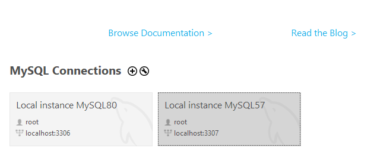

## 라이브러리 개발환경 구성요소
Visual Studio 2022 or 2019 [필수]  
단, Visual Studio 설치 구성 요소 중 Deskop development With C++이 체크되어 설치되어있어야 합니다.

 
 

## Visual Studio 2019 빌드 방법
1. Visual Studio 2019로 Harmony_VS2022.sln 솔루션을 엽니다.
2. Example, Project, Project 필터 내의 모든 프로젝트를 한번에 선택한 후 우클릭 속성에 들어갑니다.
   (Engine 필터는 건들지 않도록합니다.)

 

3. 플랫폼 툴셋은 2019로 변경합니다.

 
 

## TankFighter 개발환경 구성 요소

1. MySQL Server 5.7.x [필수]
2. MySQL Workbench 8.0.37 [선택]

 
 

## TankFighter 프로젝트 개발을 위한 MySQL 설치 방법

1. [MySQL 통합 Installer - Community](/Installers/mysql-installer-web-community-8.0.31.0.msi)를 다운로드 받습니다.
2. Custom 설치 선택 후 MySQL Server 5.7.x 버전과 MySQL Workbench를 선택하고 다운로드 받습니다.

3. 서버 세팅을 완료 한 후 Worbench를 실행합니다.
4. MySQL57 서버 인스턴스를 선택한 후 로그인을 합니다.

5. \Projects\TankFighter-Server\SQL\TankFighter.sql 를 불러온 후 쿼리를 실행합니다.

6. 이후 아래의 실행 방법 순서대로 진행하면 됩니다.

 
 

## TankFighter 실행 방법
1. 서버 Bind Port, DB 연결 설정 변경은 [ServerConfigureation.h](../Projects/TankFighter-Server/Sources/TF/ServerConfiguration.h)파일에서 수정가능합니다.
원하는 설정으로 변경후 저장합니다.
2. 클라이언트 연결 설정은 [ClientConfiguration.h](../Projects/TankFighter-Client/Classes/TF/Network/ClientConfiguration.h)파일에서 수정이 가능합니다.
원하는 설정으로 변경 후 저장합니다.
3. 통합 SQL 스크립트는 Projects/TankFighter-Server/SQL/TankFighter.sql을 MySQL로 실행합니다. 
5. 솔루션에서 TankFighter-Server 프로젝트를 선택하고 Ctrl + F5를 눌러서 실행합니다.
6. 솔루션에서 TankFighter-Client 프로젝트를 선택하고 Ctrl + F5를 눌러서 실행합니다.

 

## JCoreBenchmark 빌드 방법
Scripts/BuildBenchmark/BuildVS2022.bat을 실행하여 구글 벤치마크 라이브러리를 뽑은 후  
F5를 눌러서 간단하게 빌드 & 실행 할 수 있습니다.

 

## 그 외의 프로젝트
F5를 눌러서 간단하게 빌드 & 실행 할 수 있습니다.

 

## 주의사항
1. TankFighter 프로젝트의 빌드 플랫폼은 무조건 x86 아키텍쳐를 선택합니다.  
   MySQL 라이브러리가 x86만 지원하기 때문입니다.
2. JCoreTest, JNetworkTest의 경우 구글테스트 프로젝트로  
   처음 빌드시에는 붉은색 줄이 많이뜨는데 무시하셔도 빌드 정상적으로 성공합니다.    
   (빌드하면 자동으로 구글 테스트 패키지가 루트 디렉토리에 설치됨.)