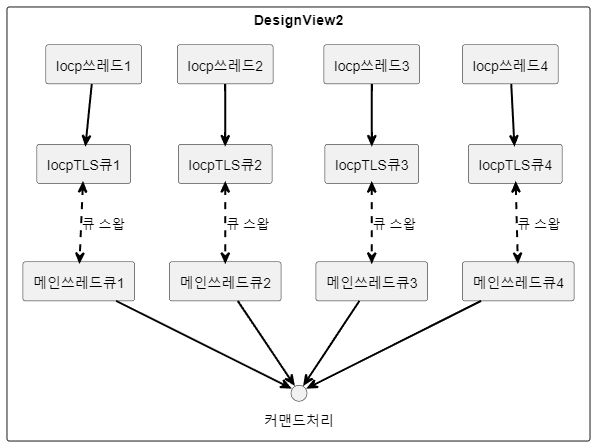
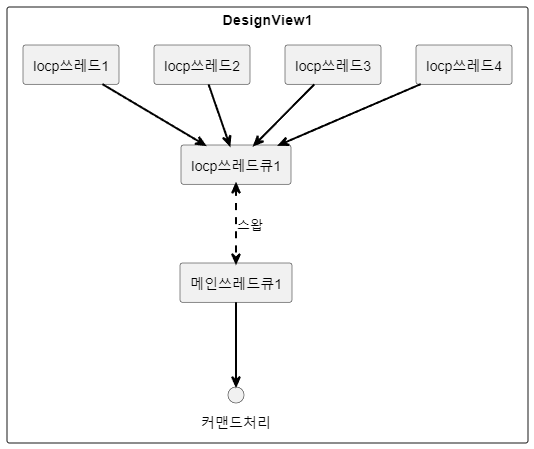

## 스왑 큐를 활용한 클라이언트 패킷 동기화

 

제가 생각한 가장 이상적인 패킷 동기화 방식입니다.  
  
 

현재 탱크파이터가 구현한 커맨드 동기화 방식입니다.
코드 복잡성과 게임 규모가 작아서 굳이 DesignView2 방식으로
구현하지 않았습니다.  
  
큐를 메인쓰레드큐와 Iocp쓰레드큐로 나눈 이유는 
큐를 하나만 사용해서 커맨드 동기화를 수행할 경우
메인쓰레드에서 락을 건 후 커맨드를 처리하는 동안 IOCP 쓰레드에서
작업을 처리하지 못하는 시간이 생겨서 심한 병목 구간이 생길것이 예상되었기 때문입니다.
  
 

### 관련 소스코드
 - 

