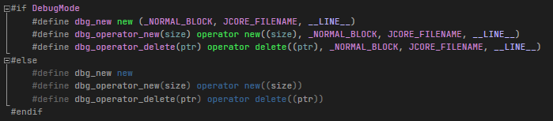

## 지속적인 확인으로 메모리 누수가 발생하지 않는 게임 개발

 

1. 모든 객체를 동적할당하여 생성할 때에는 자체 정의한 매크로 함수를 사용하여 동적할당하도록 하였습니다. 

2. [_CRTDBG_LEAK_CHECK_DF플래그](https://learn.microsoft.com/en-us/cpp/c-runtime-library/reference/crtsetdbgflag?view=msvc-170)를 활용하여 프로그램 종료시 지속적으로 메모리릭 정보를 확인하여 빠르게 릭을 찾아낼 수 있었습니다.

 

