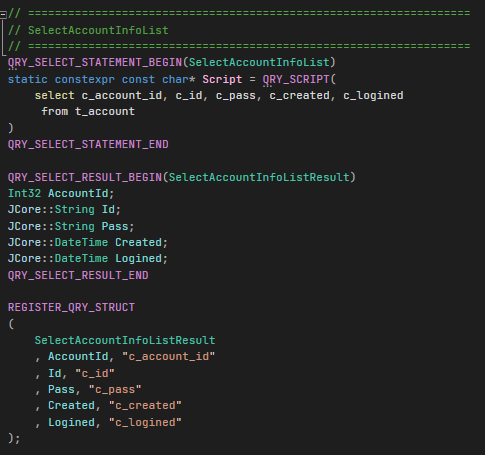

## 매크로를 활용한 Select 쿼리 바인딩 구현

 

### 만든 계기
Select 쿼리 결과를 원하는 구조체에 즉시 바인딩해주는 기능을 구현해보고 싶었습니다. 

 

### 구현 과정
이를 손쉽게 구현하기 위해서는 Reflection기능이 필요했습니다. C++은 Java와 C#과는 달리 해당기능을 지원해주지 않기 때문에 깃허브 [오픈소스](https://github.com/cbeck88/visit_struct)를 참고하기로 했습니다.

매크로를 활용해서 Reflection을 구현하고 있었는데 당시 매크로와 관련해서 지식이 거의 없다시피해서 매크로에 대해서 새롭게 공부한 후 
다시 코드 분석에 들어갔습니다.  

분석후에는 구조체의 필드들과 Select쿼리의 컬럼들을 바인딩하는 기능을 손쉽게 구현할 수 있게 되었습니다.