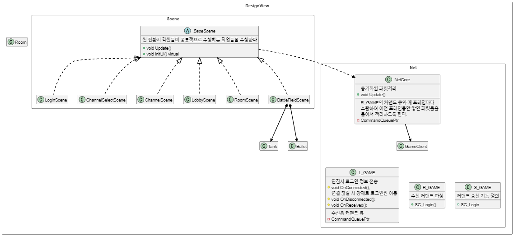

### TankFighter 프로젝트
제가 개발한 JCore 라이브러리와 JNetwork 라이브러리를 활용하여
만든 간단한 예제 게임입니다.

 

### TankFighter 프로젝트별 세부 구조

#### <서버 구조>

 

#### <데이터베이스 구조>

 

#### <클라이언트 구조>

 

### TankFighter 주요 구현 내역
 - 메모리 누수 없는 안전한 서버 종료
 - 쿼리 빌더 구현 [(코드 보기)](../Projects/TankFighter-Server/Sources/TF/Database/MysqlStatementBuilder.h)
 - 비동기 쿼리 처리 구현 [(코드 보기)](../Projects/TankFighter-Server/Sources/TF/Database/MysqlQueryFuture.h)
 - 배틀 중 난입 기능 구현 [(코드 보기)](../Projects/TankFighter-Server/Sources/TF/Worker/BattleFieldWorker.cpp)  
 - 클라이언트 쓰레드 동기화 [(코드 보기)](../Projects/TankFighter-Client/Classes/TF/Network/GameClientEventListener.cpp)

 

### [TankFighter 설명 영상 보기](https://youtu.be/2aqGhMcjXNk)
