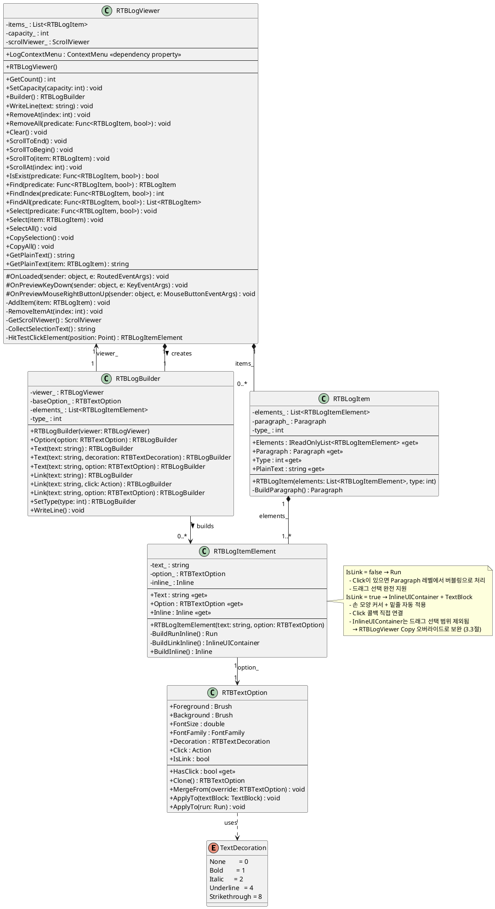

# RTBLogViewer 구현 계획서

## 1. 요구사항 정리

### 1.1 기본 기능
- `RichTextBox` 기반 로그 뷰어
- 텍스트 드래그 선택 가능 (복사 지원)
- 배경색 설정 가능 (`rtbLog_.Background = Brushes.Black`)

### 1.2 로그 항목 구성
- 로그 한 줄 = `RTBLogItem` = `Paragraph` 1개
- 로그 한 줄은 여러 `RTBLogItemElement`로 구성됨
- 각 `RTBLogItemElement`는 독립적인 `RTBTextOption` 적용 가능

```
RTBLogItem (Paragraph 1개)
 ├── RTBLogItemElement: "[ERROR]"      → RED, BOLD
 ├── RTBLogItemElement: "이 파일"      → IsLink=true → 손 모양 커서 + 밑줄 + 클릭 이벤트
 ├── RTBLogItemElement: "다운로드"     → Click 有, IsLink=false → 클릭은 되지만 Run으로 빌드
 └── RTBLogItemElement: "에 오류가 발생했습니다."
```

### 1.3 클릭 가능한 텍스트 요구사항
- `Click` 콜백은 **모든 `RTBLogItemElement`에 설정 가능** (`Run` 포함)
  - `Run`에 Click이 있을 경우: `MouseLeftButtonDown`을 `Paragraph`를 통해 버블링 방식으로 처리
- `IsLink = true`인 경우에만 `InlineUIContainer + TextBlock`으로 빌드
  - 손 모양 커서, 밑줄 자동 적용
  - 드래그 선택 범위에서 텍스트가 제외되는 문제는 `RTBLogViewer`의 Copy 커맨드 오버라이드로 보완
- `IsLink = false`이고 `Click`이 있는 경우: `Run`으로 빌드하되 `Paragraph.MouseLeftButtonDown`에서 hit-test로 처리
- **드래그 선택 범위에 클릭 가능한 텍스트도 포함되어야 함**
  - `[ERROR]`와 `에 오류가 발생했습니다.`가 선택될 때 사이의 클릭 가능 텍스트도 함께 복사

### 1.4 RTBTextOption 요구사항
```csharp
RTBTextOption baseOption = new RTBTextOption();
baseOption.Decoration = RTBTextDecoration.Bold;

RTBTextOption specificOption = new RTBTextOption();
specificOption.Decoration = RTBTextDecoration.Italic | RTBTextDecoration.Bold;
specificOption.FontSize = 16;
specificOption.FontFamily = ...;
specificOption.Foreground = Brushes.Red;
specificOption.Background = Brushes.Blue;
specificOption.IsLink = true;   // InlineUIContainer + TextBlock으로 빌드됨
specificOption.Click = () => { };
```

### 1.5 Builder 패턴
```csharp
rtbLog_.Builder()
    .Option(baseOption)
    .Text("[ERROR]", RTBTextDecoration.Bold)
    .Text("이 파일", specificOption)           // IsLink=true → InlineUIContainer
    .Text("다운로드", clickOnlyOption)         // IsLink=false, Click 有 → Run + 버블링 클릭
    .Text("에 오류가 발생했습니다.")
    .SetType(5000)
    .WriteLine();
```

### 1.6 RTBLogViewer API
```csharp
rtbLog_.Background = Brushes.Black;
rtbLog_.GetCount();
rtbLog_.SetCapacity(int);
rtbLog_.RemoveAt(int index);
rtbLog_.RemoveAll(Func<RTBLogItem, bool>);
rtbLog_.Clear();
rtbLog_.ScrollToEnd();
rtbLog_.ScrollToBegin();
rtbLog_.ScrollTo(RTBLogItem);
rtbLog_.ScrollAt(int index);
rtbLog_.IsExist(Func<RTBLogItem, bool>);
rtbLog_.Find(Func<RTBLogItem, bool>);
rtbLog_.FindIndex(Func<RTBLogItem, bool>);
rtbLog_.FindAll(Func<RTBLogItem, bool>);
rtbLog_.Select(Func<RTBLogItem, bool>);
rtbLog_.Select(RTBLogItem);
rtbLog_.SelectAll();
rtbLog_.CopySelection();        // 선택 텍스트를 클립보드에 복사 (InlineUIContainer 포함)
rtbLog_.CopyAll();              // 전체 텍스트를 클립보드에 복사
rtbLog_.GetPlainText();         // 전체 로그를 PlainText로 반환
rtbLog_.GetPlainText(RTBLogItem);   // 특정 항목 PlainText 반환
```

### 1.7 ContextMenu 요구사항
- 기본 `RichTextBox` 컨텍스트 메뉴(잘라내기/붙여넣기 등) **완전 비활성화**
- 외부에서 ContextMenu를 주입할 수 있어야 함
  - **XAML**: `<ctrl:RTBLogViewer.LogContextMenu>` 로 `ContextMenu` 직접 선언
  - **코드**: `rtbLog_.LogContextMenu = new ContextMenu { ... }`
- ContextMenu가 설정되지 않은 경우 마우스 우클릭 시 아무 메뉴도 표시되지 않음
- ContextMenu 항목 예시:
  ```
  [복사]          → 선택 영역 복사 (CopySelection 내부 로직 재사용)
  [전체 복사]     → 전체 텍스트 복사
  [전체 선택]     → SelectAll()
  [지우기]        → Clear()
  ```

---

## 2. 클래스 구조 (PlantUML)



---

## 3. 각 클래스별 구현 내용

### 3.1 `TextDecoration` (Flags enum)

```csharp
[Flags]
public enum RTBTextDecoration
{
    None          = 0,
    Bold          = 1 << 0,
    Italic        = 1 << 1,
    Underline     = 1 << 2,
    Strikethrough = 1 << 3,
}
```

- WPF의 `System.Windows.TextDecorations`와 이름 충돌을 피하기 위해 `RTBTextDecoration`으로 명명
- `Flags` 어트리뷰트로 비트 조합 허용 (`Bold | Italic`)

---

### 3.2 `RTBTextOption` (class)

| 필드 | 타입 | 기본값 | 설명 |
|---|---|---|---|
| `Foreground` | `Brush` | `null` (부모 상속) | 글자 색 |
| `Background` | `Brush` | `null` (투명) | 배경 색 |
| `FontSize` | `double` | `double.NaN` (부모 상속) | 폰트 크기 |
| `FontFamily` | `FontFamily` | `null` (부모 상속) | 폰트 |
| `Decoration` | `RTBTextDecoration` | `None` | Bold/Italic 등 |
| `Click` | `Action` | `null` | 클릭 콜백 |
| `IsLink` | `bool` | `false` | true이면 InlineUIContainer로 빌드 |

- `HasClick` → `Click != null`
- `IsLink = true`이면 `BuildLinkInline()` 경로 진입 (손 모양 커서 + 밑줄)
- `IsLink = false`이고 `HasClick = true`이면 `Run`으로 빌드되고 Paragraph 레벨 hit-test로 클릭 처리
- `Clone()` → 깊은 복사 (Builder에서 baseOption 병합 시 원본 보호)
- `MergeFrom(override)` → null/NaN/None 필드는 base 값 유지
- `ApplyTo(TextBlock)` → `IsLink=true` 요소(TextBlock)에 적용
- `ApplyTo(Run)` → `IsLink=false` 일반 Run에 적용

---

### 3.3 `RTBLogItemElement` (class) — 핵심 구현

#### IsLink = false (기본) → `Run`
```csharp
Run run = new Run(text_);
option_.ApplyTo(run);
// 드래그 선택 완전 지원
// Click이 있는 경우 → RTBLogItem(Paragraph)에서 버블링 hit-test로 처리
```

#### IsLink = true → `InlineUIContainer + TextBlock`
```csharp
TextBlock tb = new TextBlock { Text = text_ };
option_.ApplyTo(tb);
tb.Cursor = Cursors.Hand;
tb.TextDecorations = System.Windows.TextDecorations.Underline;  // 링크 시각화
if (option_.HasClick)
    tb.MouseLeftButtonDown += (_, _) => option_.Click();

return new InlineUIContainer(tb);
```

#### ⚠️ IsLink = false + HasClick → Run 클릭 처리

`Run`은 마우스 이벤트를 직접 받을 수 없으므로, `RTBLogItem`(Paragraph)의
`MouseLeftButtonDown`에서 클릭 위치를 hit-test하여 해당 `RTBLogItemElement`를 찾아 `Click()`을 호출.

```csharp
// RTBLogItem 내부 (Paragraph.MouseLeftButtonDown)
paragraph_.MouseLeftButtonDown += (sender, e) => {
    Point pos = e.GetPosition((IInputElement)sender);
    RTBLogItemElement hit = HitTestElement(pos);
    if (hit?.Option.HasClick == true && !hit.Option.IsLink)
        hit.Option.Click();
};
```

#### ⚠️ 드래그 선택 문제 해결 방안

`InlineUIContainer`는 WPF의 `TextSelection` 범위에서 텍스트로 취급되지 않아 **Ctrl+C 복사 시 내용이 빠짐**.

**해결책: 복사 이벤트 후킹**

`RTBLogViewer`의 `Copy` 커맨드 바인딩을 오버라이드:
1. `RichTextBox.Selection`의 Start~End 범위를 직접 순회
2. 범위 내의 `Inline` 요소들을 순서대로 탐색
3. `Run` → `.Text` 그대로 수집
4. `InlineUIContainer` → 내부 `TextBlock.Text` 수집
5. 수집된 텍스트를 `Clipboard.SetText()`로 직접 설정

```csharp
// RTBLogViewer 내부
CommandBindings.Add(new CommandBinding(
    ApplicationCommands.Copy,
    (s, e) => { CopySelection(); e.Handled = true; },
    (s, e) => { e.CanExecute = true; }
));
```

이 방식으로 `InlineUIContainer`의 텍스트도 선택 범위에 포함하여 복사 가능.

---

### 3.4 `RTBLogItem` (class)

- `Paragraph` 1개를 소유
- 생성 시 `elements_`를 순회하며 각 `Inline`을 `Paragraph.Inlines`에 추가
- `PlainText` → 모든 `RTBLogItemElement.Text`를 이어 붙인 문자열 (검색/필터용)
- `Type` → `SetType()`으로 지정한 정수값 (로그 종류 구분용)
- `IsLink=false + HasClick` 요소를 위해 `Paragraph.MouseLeftButtonDown` 등록

---

### 3.5 `RTBLogBuilder` (class)

Builder 패턴으로 체이닝 지원:

```csharp
rtbLog_.Builder()
    .Option(baseOption)                              // 기본 옵션 설정
    .Text("[ERROR]", RTBTextDecoration.Bold)         // 기본 옵션 + Bold 오버라이드
    .Text("이 파일", specificOption)                 // specificOption 전체 오버라이드
    .Link("다운로드", () => OpenFile())              // IsLink=true 자동 설정
    .Text("에 오류가 발생했습니다.")                 // 기본 옵션만 적용
    .SetType(5000)                                   // RTBLogItem.Type 설정
    .WriteLine();                                    // RTBLogItem 완성 후 Viewer에 추가
```

- `Option(option)` → 이후 모든 `.Text()` / `.Link()`의 기본값으로 사용
- `Text(text, option)` → `baseOption_.Clone()`에 `option` 필드를 덮어쓰기 (null인 필드는 base 유지)
- `Text(text, decoration)` → `baseOption_.Clone()`에서 `Decoration`만 교체
- `Link(text)` → `IsLink=true`를 자동으로 적용한 옵션으로 요소 추가
- `Link(text, click)` → `IsLink=true` + `Click` 설정
- `Link(text, option)` → 전달된 옵션에 `IsLink=true`를 강제 적용
- `MergeFrom` 로직에서 `IsLink`는 명시적으로 `true`인 경우에만 override

---

### 3.6 `RTBLogViewer` (class, `RichTextBox` 상속)

#### 초기화
```csharp
public RTBLogViewer()
{
    IsUndoEnabled = false;        // Undo 비활성화 (편집 불가 모드)
    IsReadOnly = false;           // InlineUIContainer 마우스 이벤트를 위해 false 유지
    // 단, PreviewKeyDown으로 실제 텍스트 입력은 차단
    Loaded += OnLoaded;
    PreviewMouseRightButtonUp += OnPreviewMouseRightButtonUp;
}
```

#### `OnLoaded` 처리
- `GetScrollViewer()` → `VisualTreeHelper`로 내부 `ScrollViewer` 캐싱
- `ApplicationCommands.Copy` 바인딩 오버라이드 등록

#### `OnPreviewKeyDown` 처리
- `Ctrl+C` / `Ctrl+A` 이외의 키 입력 모두 `Handled = true`로 차단
- 텍스트가 입력되지 않도록 방지

#### ContextMenu 처리
```csharp
// DependencyProperty로 선언 → XAML/코드 양쪽 지원
public static readonly DependencyProperty LogContextMenuProperty =
    DependencyProperty.Register(nameof(LogContextMenu), typeof(ContextMenu),
        typeof(RTBLogViewer), new PropertyMetadata(null));

public ContextMenu LogContextMenu
{
    get => (ContextMenu)GetValue(LogContextMenuProperty);
    set => SetValue(LogContextMenuProperty, value);
}

// 기본 ContextMenu 완전 비활성화
// PreviewMouseRightButtonUp에서 LogContextMenu가 있으면 열고, 없으면 아무것도 하지 않음
protected override void OnPreviewMouseRightButtonUp(MouseButtonEventArgs e)
{
    e.Handled = true;   // 기본 RichTextBox ContextMenu 차단
    if (LogContextMenu != null)
    {
        LogContextMenu.PlacementTarget = this;
        LogContextMenu.IsOpen = true;
    }
}
```

**XAML에서 사용 예시:**
```xml
<ctrl:RTBLogViewer>
    <ctrl:RTBLogViewer.LogContextMenu>
        <ContextMenu>
            <MenuItem Header="복사"      Command="{x:Static ApplicationCommands.Copy}" />
            <MenuItem Header="전체 복사" Click="OnCopyAll_Click" />
            <MenuItem Header="전체 선택" Click="OnSelectAll_Click" />
            <Separator />
            <MenuItem Header="지우기"   Click="OnClear_Click" />
        </ContextMenu>
    </ctrl:RTBLogViewer.LogContextMenu>
</ctrl:RTBLogViewer>
```

**코드에서 사용 예시:**
```csharp
rtbLog_.LogContextMenu = new ContextMenu();
rtbLog_.LogContextMenu.Items.Add(new MenuItem { Header = "복사",
    Command = ApplicationCommands.Copy });
rtbLog_.LogContextMenu.Items.Add(new MenuItem { Header = "전체 복사" });
```

#### `CopySelection()` / `CopyAll()` 구현
```csharp
// CopySelection: 선택 영역 내 Run + InlineUIContainer 텍스트 모두 수집
public void CopySelection()
{
    string text = CollectSelectionText();
    if (!string.IsNullOrEmpty(text))
        Clipboard.SetText(text);
}

// CopyAll: 전체 로그 PlainText 클립보드 복사
public void CopyAll() => Clipboard.SetText(GetPlainText());
```

#### `GetPlainText()` 유틸 구현
```csharp
public string GetPlainText()
{
    var sb = new StringBuilder();
    foreach (var item in items_)
        sb.AppendLine(item.PlainText);
    return sb.ToString();
}

public string GetPlainText(RTBLogItem _item) => _item.PlainText;
```

#### `FindIndex()` 유틸 구현
```csharp
public int FindIndex(Func<RTBLogItem, bool> _predicate)
    => items_.FindIndex(i => _predicate(i));
```

#### `SelectAll()` 구현
```csharp
public void SelectAll()
{
    Selection.Select(Document.ContentStart, Document.ContentEnd);
    Focus();
}
```

#### `ScrollTo(RTBLogItem)` 구현
```csharp
public void ScrollTo(RTBLogItem _item)
{
    Rect rect = _item.Paragraph.ContentStart
        .GetCharacterRect(LogicalDirection.Forward);
    scrollViewer_.ScrollToVerticalOffset(
        scrollViewer_.VerticalOffset + rect.Top);
}
```

#### `Select(RTBLogItem)` 구현
```csharp
public void Select(RTBLogItem _item)
{
    TextPointer start = _item.Paragraph.ContentStart;
    TextPointer end = _item.Paragraph.ContentEnd;
    Selection.Select(start, end);
    Focus();
}
```

#### `SetCapacity` + `RemoveAt` 처리
```csharp
private void AddItem(RTBLogItem _item)
{
    while (items_.Count >= capacity_)
        RemoveItemAt(0);

    items_.Add(_item);
    Document.Blocks.Add(_item.Paragraph);
}

private void RemoveItemAt(int _index)
{
    Document.Blocks.Remove(items_[_index].Paragraph);
    items_.RemoveAt(_index);
}
```

---

## 4. 구현 순서

```
1단계  RTBTextDecoration.cs     → [Flags] enum
2단계  RTBTextOption.cs         → IsLink 필드 추가, MergeFrom 로직 업데이트
3단계  RTBLogItemElement.cs     → IsLink 기준으로 Run / InlineUIContainer 분기
4단계  RTBLogItem.cs            → Paragraph 구성, MouseLeftButtonDown hit-test 등록
5단계  RTBLogBuilder.cs         → Link() 메서드 추가
6단계  RTBLogViewer.cs          → LogContextMenu DependencyProperty, CopySelection/CopyAll/GetPlainText/FindIndex/SelectAll 추가
7단계  CustomStyleKey.cs 수정   → RTBLogViewerKey 상수 추가
8단계  RTBLogViewer.xaml        → Style (배경, 패딩, 선택색 등), ContextMenu="{x:Null}" 로 기본 메뉴 제거
9단계  All.xaml 수정            → RTBLogViewer.xaml 머지 추가
```

---

## 5. 파일 구성

```
Projects/SteinsGate-Tools.Common/Project/
├── CustomControl/
│   ├── LogListBox.cs                 (기존 유지)
│   ├── RTBTextDecoration.cs          (신규)
│   ├── RTBTextOption.cs              (신규, IsLink 추가)
│   ├── RTBLogItemElement.cs          (신규, IsLink 기준 분기)
│   ├── RTBLogItem.cs                 (신규, MouseLeftButtonDown hit-test)
│   ├── RTBLogBuilder.cs              (신규, Link() 메서드 추가)
│   └── RTBLogViewer.cs               (신규, LogContextMenu + 유틸 API)
├── CustomStyle/
│   ├── All.xaml                      (수정: RTBLogViewer.xaml 추가)
│   ├── CustomStyleKey.cs             (수정: RTBLogViewerKey 추가)
│   └── RTBLogViewer.xaml             (신규, ContextMenu="{x:Null}" 포함)
```

---

## 6. 주요 기술 결정 요약

| 항목 | 결정 | 이유 |
|---|---|---|
| 기반 컨트롤 | `RichTextBox` 상속 | 드래그 선택, 복사 기본 지원 |
| `IsReadOnly` | `false` (편집 차단은 `PreviewKeyDown`으로) | `IsReadOnly=true` 시 `InlineUIContainer` 내 마우스 이벤트 미작동 |
| `IsUndoEnabled` | `false` | Undo 스택 메모리 낭비 방지 |
| Link가 아닌 텍스트 | `Run` | 드래그 선택 완전 지원, 경량 |
| Link 텍스트 (`IsLink=true`) | `InlineUIContainer + TextBlock` | `Hyperlink` 없이 커서/클릭 이벤트 지원 |
| Click + IsLink=false | `Run` + Paragraph hit-test | 드래그 선택 유지하면서 클릭 처리 |
| 복사 시 `InlineUIContainer` 텍스트 포함 | `ApplicationCommands.Copy` 오버라이드 | WPF 기본 복사는 `InlineUIContainer` 텍스트 제외 |
| 기본 ContextMenu 비활성화 | `OnPreviewMouseRightButtonUp`에서 `e.Handled = true` | `ContextMenu = null`만으로는 내부 RichTextBox 메뉴가 뜨는 경우 있음 |
| ContextMenu 외부 주입 | `LogContextMenu` DependencyProperty | XAML 선언과 코드 할당 양쪽 지원 |
| 항목 추적 | 내부 `List<RTBLogItem>` | `FlowDocument.Blocks` 직접 LINQ 탐색보다 빠름 |
| Capacity 초과 시 | `RemoveAt(0)` (FIFO) | 기존 `LogListBox`와 동일한 정책 |
